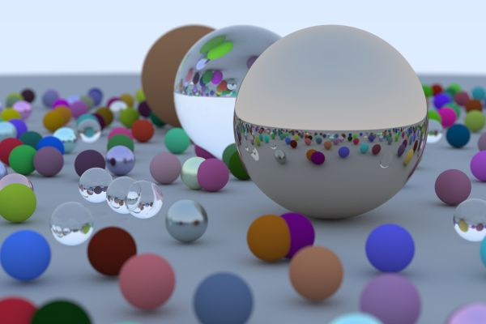

# Rust Raytracer

Based on [The Ray Tracing Road to Rust](https://the-ray-tracing-road-to-rust.vercel.app/), which in turn is based on [Ray Tracing in One Weekend](https://raytracing.github.io/).

## Building and running

### Debug mode

- Build: `cargo build`
- Run: `cargo run`

## Release mode

- Build: `cargo build --release`
- Run: `cargo run --release`
